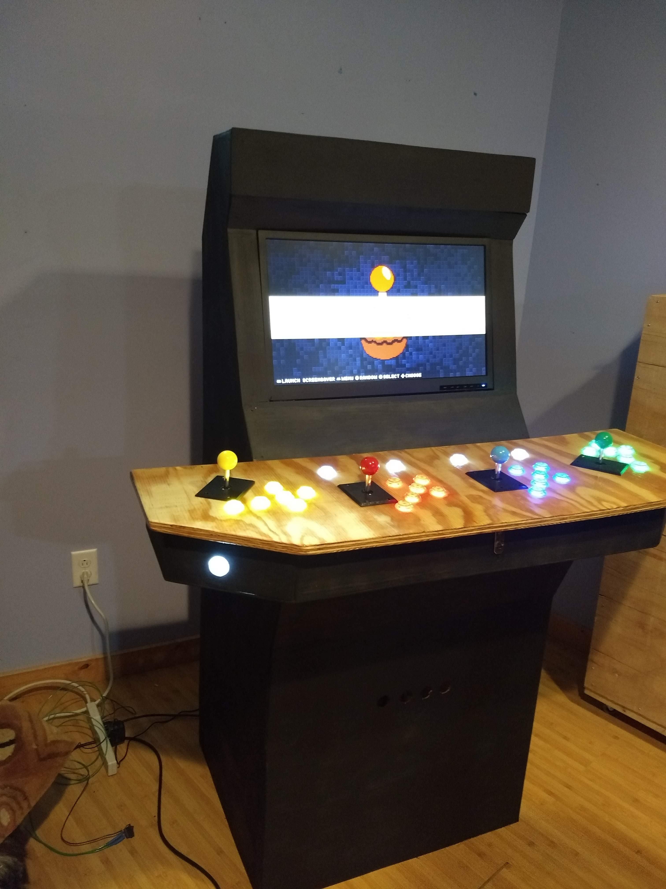
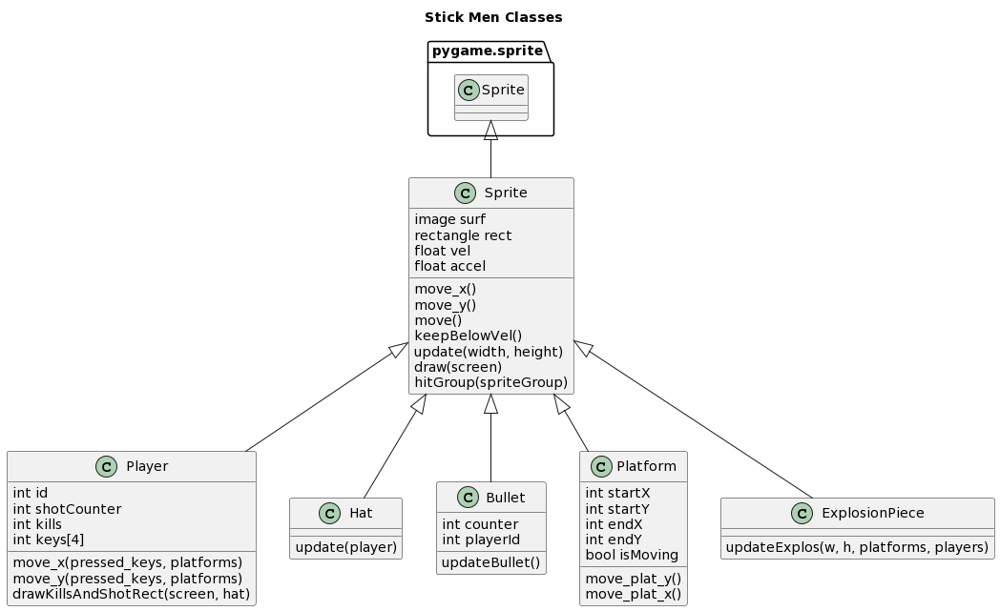

# Stick_Men
 A new game for my new arcade
 
 ## Intro
 
 This is a game I wrote to play on a home made arcade system I built.  It's in python and uses the pygame library.
 
 
 
 The game is fairly straight forward.  The object is to score more points then your opponent. Each player can move and jump around stationary and moving platforms, using realistic physics.
 
  
  
   
 
 ## Installation
 
Use your favorite method for making sure pygame is available on the computer you are playing on (on my Raspberry Pi, I install it in a virtual environment).  The program will attempt to detect joysticks (like I have on my arcade machine).  If these aren't found, it assumes you're playing on a computer and uses the keyboard for player control.

## Design

Since the game is using the pygame library, the main.py contains the calls to init pygame, and the game's main loop where pygame Sprite's are updated and drawn on the screen.  The sprites for players, platforms and other objects on the screen are organized using a class heirarchy.  All the common behavior of objects is captured in a base class 'Sprite', and then individual behaviors are coded in each child class.

   

## Tests

For developing the game I did the usual kind of coding, playing the game, fixing bug cycle.  But I learned about the unittest library and more controlled ways of testing my code.  I haven't fleshed these out too much, but they were useful in revealing and solving some bugs.  Find these in the tests directory, and just run 'python [name of test.py]'

 
